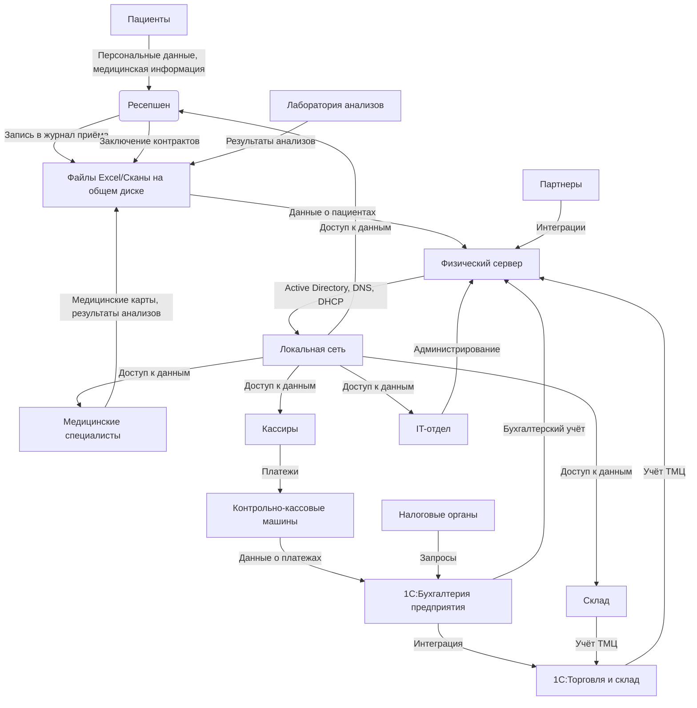
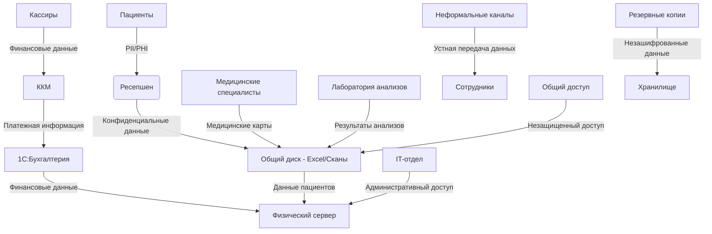
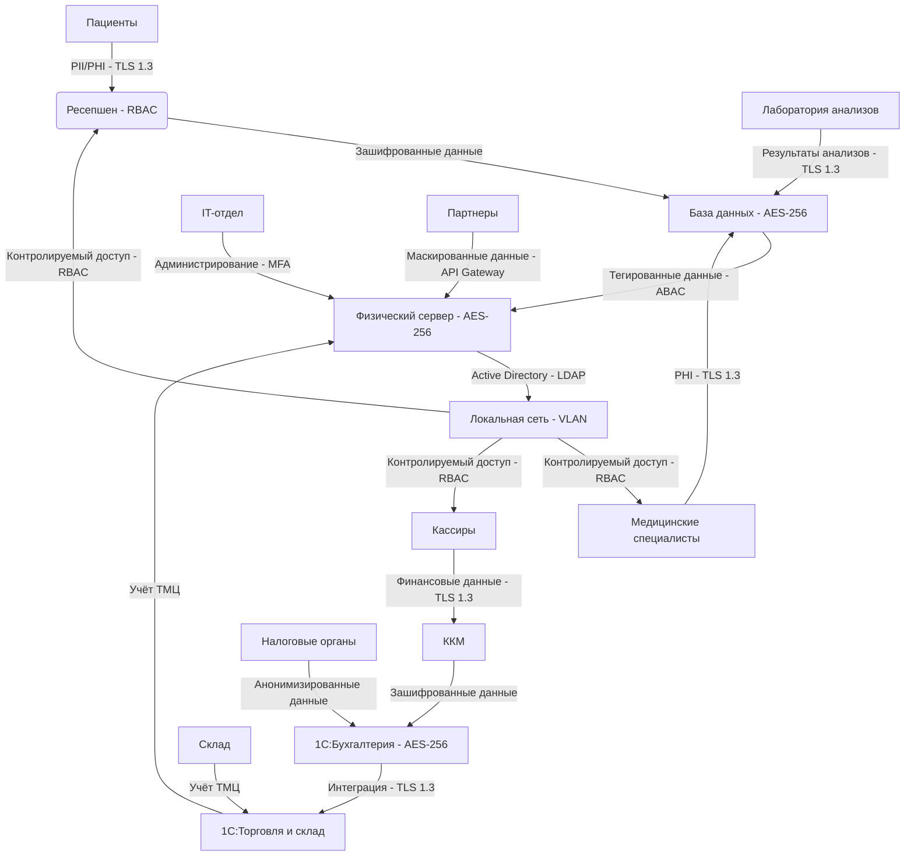
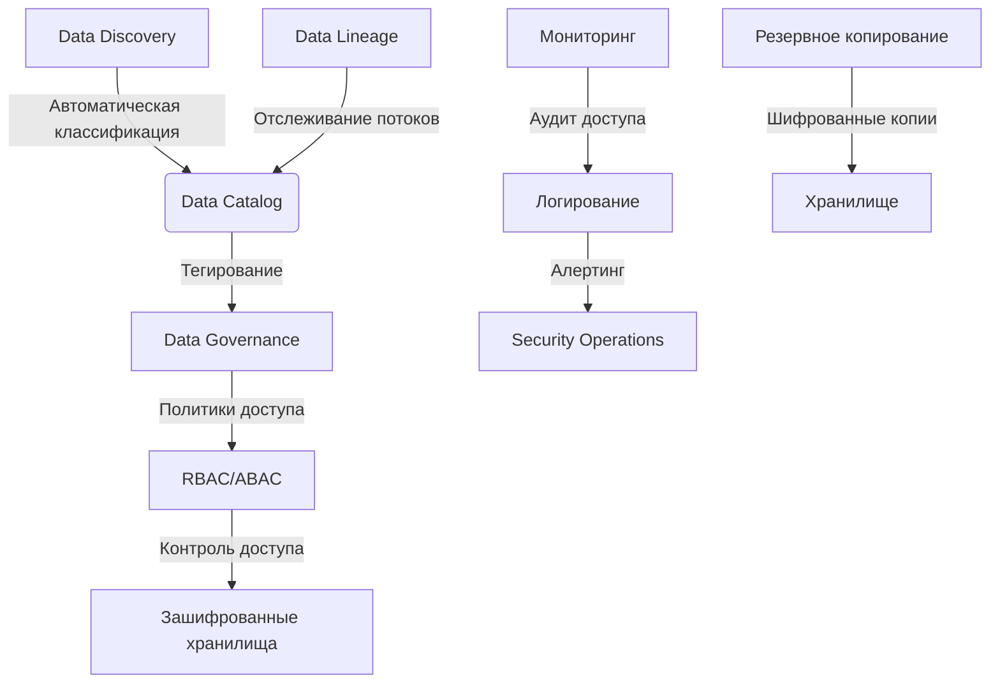

# Анализ безопасности данных для "Медикаменте"

## Конфиденциальные данные, не учтенные во внутренних системах

Выявлены следующие категории конфиденциальных данных, не учтенных во внутренних системах:

### Персональные данные пациентов (PII - Personally Identifiable Information)
- Полные имена пациентов
- Даты рождения
- Адреса регистрации и проживания
- Номера телефонов
- Адреса электронной почты
- Паспортные данные (при наличии)
- СНИЛС и ИНН (при наличии)

### Медицинская информация (PHI - Protected Health Information)
- История болезней
- Диагнозы
- Результаты медицинских анализов
- Назначения и рецепты
- Данные о хронических заболеваниях
- Информация о проведенном лечении

### Финансовые данные
- Информация о произведенных платежах
- Данные о задолженностях
- Банковские реквизиты (при наличии)

### Данные сотрудников
- Персональные данные медицинского персонала
- Квалификационные документы
- Графики работы
- Данные о заработной плате

### Данные, передаваемые неформальными каналами
- Информация, передаваемая через мессенджеры между сотрудниками
- Данные, передаваемые по телефону без документального подтверждения
- Информация, передаваемая устно при личных встречах

Эти данные не учтены в системах компании по следующим причинам:
- Отсутствие централизованной системы хранения данных
- Использование разрозненных Excel-файлов и сканов документов
- Отсутствие механизмов аудита доступа к данным
- Недостаточный контроль над каналами передачи информации
- Отсутствие классификации данных по уровням конфиденциальности

## Диаграммы потоков данных

### Текущее состояние (As-Is) - Основные потоки данных

### Текущее состояние (As-Is) - Потоки конфиденциальных данных

## Проблемные зоны в обеспечении безопасности данных

### Аудит соответствия мер безопасности требованиям

На основе анализа текущего состояния компании "Медикаменте" и сравнения с принципами Privacy by Design и требованиями законодательства РФ (152-ФЗ), проведем аудит существующих мер безопасности данных:

#### Проактивный, а не реактивный подход

**Текущее состояние:** Компания реагирует на проблемы с данными постфактум, без проактивных мер.

**Проблемы:**
- Отсутствие оценки рисков конфиденциальности на этапе планирования
- Нет Privacy Impact Assessment (PIA)
- Отсутствие постоянного мониторинга угроз
- Нет моделирования угроз и планирования мер противодействия

#### Конфиденциальность по умолчанию

**Текущее состояние:** Системы не обеспечивают защиту персональных данных автоматически.

**Проблемы:**
- Отсутствие минимизации данных (Data Minimization)
- Нет настроек по умолчанию с максимальной конфиденциальностью
- Отсутствуют механизмы оптинга (согласия пользователей)
- Все сотрудники имеют доступ ко всем данным

#### Конфиденциальность, заложенная в дизайн

**Текущее состояние:** Конфиденциальность не является неотъемлемой частью архитектуры систем.

**Проблемы:**
- Отсутствие встроенных механизмов шифрования
- Нет анонимизации и псевдонимизации в процессах обработки данных
- Отсутствие архитектурных паттернов, поддерживающих конфиденциальность
- Нет учета влияния конфиденциальности на всех этапах жизненного цикла системы

#### Полная функциональность без компромиссов

**Текущее состояние:** Нет баланса между конфиденциальностью и другими целями.

**Проблемы:**
- Конфиденциальность рассматривается как ограничение функциональности
- Отсутствуют инновационные технологии для обеспечения конфиденциальности без ущерба для удобства
- Нет сотрудничества с заинтересованными сторонами для поиска взаимовыгодных решений

#### Комплексная безопасность - Полный жизненный цикл защиты

**Текущее состояние:** Защита данных осуществляется не на протяжении всего их жизненного цикла.

**Проблемы:**
- Отсутствие шифрования данных в состоянии покоя (AES-256)
- Нет безопасной передачи данных (TLS/SSL)
- Отсутствуют процедуры безопасного удаления или анонимизации данных
- Нет политик утилизации данных

#### Наглядность и прозрачность

**Текущее состояние:** Системы и процессы не являются прозрачными для пользователей.

**Проблемы:**
- Отсутствуют четкие и доступные политики конфиденциальности
- Нет контроля у пользователей над их данными
- Отсутствуют возможности проверки практики обработки данных
- Нет протоколирования и мониторинга доступа к данным

#### Уважение к конфиденциальности пользователей

**Текущее состояние:** Интересы пользователей не ставятся на первое место.

**Проблемы:**
- Отсутствуют механизмы согласия пользователей
- Нет удобного для пользователя дизайна интерфейсов управления конфиденциальностью
- Отсутствуют каналы для пользователей по вопросам конфиденциальности
- Нет отзывчивой поддержки по запросам конфиденциальности

### Специфические проблемные зоны

#### Управление доступом
- Отсутствие ролевой модели доступа (RBAC)
- Все сотрудники имеют неограниченный доступ к данным
- Нет атрибутной модели доступа (ABAC) для динамического контроля
- Отсутствует принцип наименьших привилегий

#### Шифрование данных
- Данные в состоянии покоя не зашифрованы
- Отсутствует шифрование данных при передаче
- Нет управления криптографическими ключами
- Отсутствуют современные алгоритмы шифрования (AES-256)

#### Аудит и мониторинг
- Нет протоколирования доступа к данным
- Отсутствует мониторинг подозрительных действий
- Нет систем алертинга при несанкционированном доступе
- Отсутствует аудит изменений данных

#### Классификация и тегирование данных
- Нет классификации данных по уровням конфиденциальности
- Отсутствует тегирование данных (Data Tagging)
- Нет автоматических механизмов маркировки конфиденциальных данных
- Отсутствует связь тегов с политиками доступа

#### Резервное копирование и восстановление
- Нет регулярного резервного копирования данных
- Отсутствуют зашифрованные резервные копии
- Нет процедур восстановления данных после инцидентов
- Отсутствует тестирование процедур восстановления

#### Физическая безопасность
- Данные хранятся на физическом сервере в том же здании
- Отсутствуют меры физической защиты серверного оборудования
- Нет контроля физического доступа к серверам
- Отсутствуют процедуры безопасного утилизирования носителей данных

## Предложения по улучшению

### Список данных для защиты и методы защиты

#### Персональные данные пациентов (PII)
**Методы защиты:**
- **Шифрование:** AES-256 для данных в состоянии покоя
- **Обфускация:** Токенизация для тестовых сред
- **Анонимизация:** Удаление идентифицирующих данных для аналитики

#### Медицинская информация (PHI)
**Методы защиты:**
- **Шифрование:** AES-256 для данных в состоянии покоя и TLS 1.3 при передаче
- **Маскировка:** Динамическая маскировка данных в интерфейсах
- **Псевдонимизация:** Замена идентификаторов для исследований

#### Финансовые данные
**Методы защиты:**
- **Шифрование:** AES-256 для данных в состоянии покоя
- **Обфускация:** Скремблирование символов для отчетов
- **Маскировка:** Статическая маскировка для разработки

#### Данные сотрудников
**Методы защиты:**
- **Шифрование:** AES-256 для данных в состоянии покоя
- **Обфускация:** Зануление для несанкционированного доступа
- **Маскировка:** Недетерминированная маскировка для HR-аналитики

### Механизм тегирования данных

#### Классификация данных по уровням конфиденциальности
- **Уровень 1 (Публичные данные):** Общедоступная информация
- **Уровень 2 (Внутренние данные):** Служебная информация
- **Уровень 3 (Конфиденциальные данные):** PII и PHI
- **Уровень 4 (Строго конфиденциальные данные):** Финансовые и персональные данные сотрудников

#### Система тегов
- **PII:** Персональные данные пациентов
- **PHI:** Защищенная медицинская информация
- **FIN:** Финансовые данные
- **EMP:** Данные сотрудников
- **TMP:** Временные/промежуточные данные
- **ARC:** Архивные данные

#### Автоматическое тегирование
- Использование Data Discovery Platforms для автоматического обнаружения и классификации данных
- Интеграция с системами управления данными для автоматического присвоения тегов при создании
- Настройка правил тегирования на основе шаблонов данных

#### Связь тегов с политиками доступа
- Теги PII и PHI ограничивают доступ только медицинскому персоналу
- Теги FIN ограничивают доступ только бухгалтерии и финансовым сотрудникам
- Теги EMP ограничивают доступ только HR и руководству

### Инструменты и меры для обеспечения конфиденциальности

#### Технические меры
- **Шифрование данных:** Внедрение AES-256 для данных в состоянии покоя и TLS 1.3 для передачи
- **Управление доступом:** Реализация RBAC и ABAC с принципом наименьших привилегий
- **Аудит и мониторинг:** Внедрение систем логирования и мониторинга доступа к данным
- **Резервное копирование:** Регулярное шифрованное резервное копирование данных
- **Защита конечных точек:** Антивирусная защита и контроль устройств

#### Организационные меры
- **Политики безопасности:** Разработка и внедрение политик обработки данных
- **Обучение персонала:** Регулярное обучение сотрудников по вопросам конфиденциальности
- **Оценка рисков:** Регулярная оценка рисков конфиденциальности
- **Инцидент-менеджмент:** Процедуры реагирования на инциденты безопасности

#### Рекомендуемые инструменты
- **BigID:** Для автоматического обнаружения и классификации данных
- **Apache Atlas:** Для управления метаданными и Data Lineage
- **Apache NiFi:** Для безопасного управления потоками данных
- **Collibra:** Для централизованного управления данными и тегированием
- **Microsoft Azure Information Protection:** Для автоматического применения меток к документам

### Обновленные диаграммы с мерами безопасности

#### Целевое состояние (To-Be) - Потоки данных с мерами безопасности

#### Целевое состояние (To-Be) - Система управления данными

