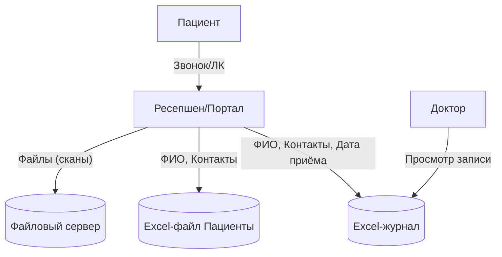
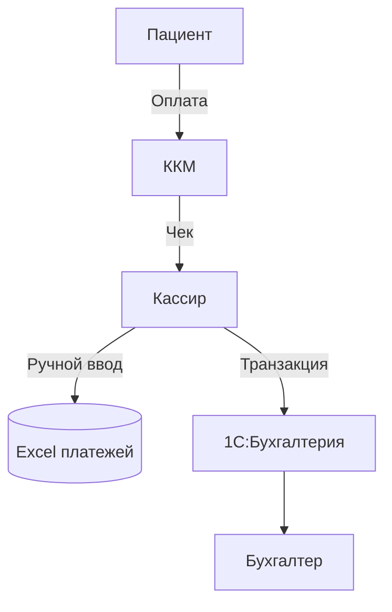
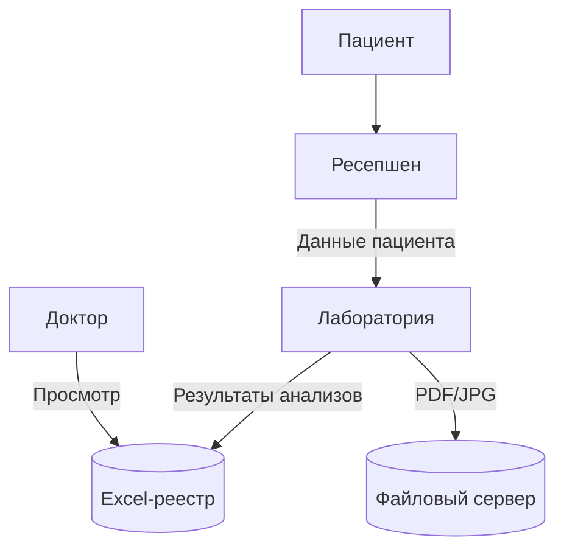
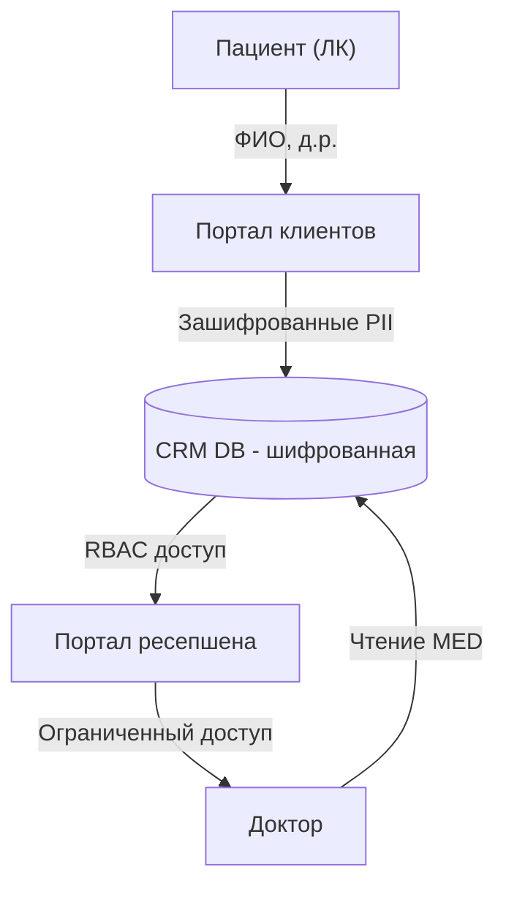
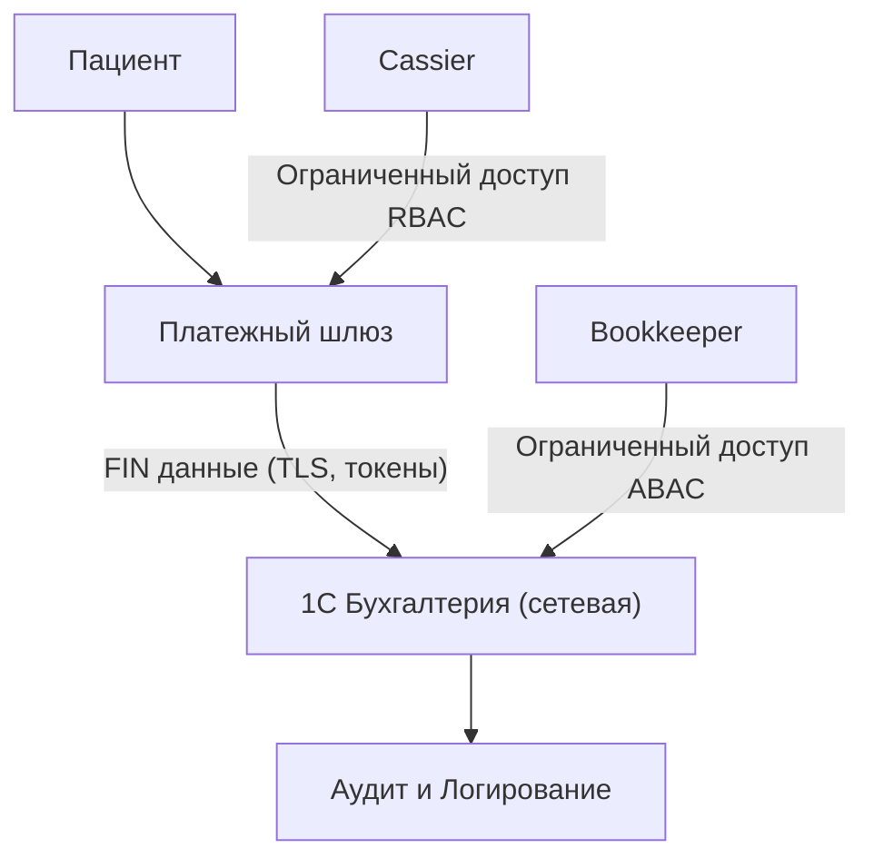
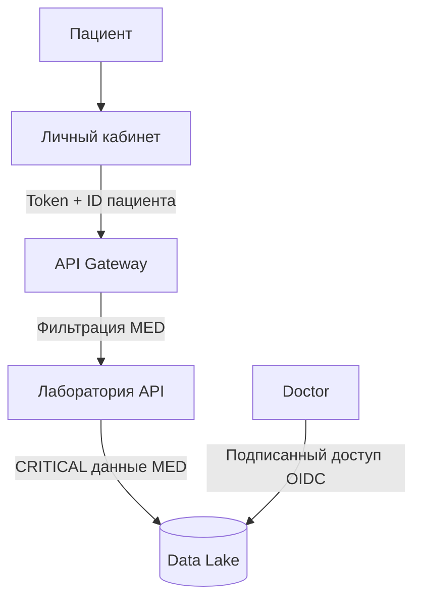

# Задание 1

## Конфиденциальные данные, которые не учтены во внутренних системах  

### Выявленные категории данных пациентов
| Категория данных | Пример | Уровень конфиденциальности | Где хранится сейчас |
|------------------|--------|---------------------------|---------------------|
| Идентификационные (PII) | ФИО, Дата рождения, Пол | Высокий | Excel (пациенты.xlsx), сканы паспортов |
| Контактные данные | Телефон, email, адрес прописки | Высокий | Excel, Outlook |
| Медицинские данные | Диагнозы, хронические заболевания, результаты анализов | Критический | Excel, PDF, JPG, сканы анализов |
| Финансовые данные | История оплат, договоры, кассовые чеки | Высокий | Excel, 1С, KKM |
| Данные сотрудников | Личные дела, зарплата, налоговая отчетность | Высокий | 1С:Бухгалтерия предприятия |
| Данные о ТМЦ | Наличие препаратов, закупки оборудования | Средний | 1С:Торговля и склад |
| Логирование событий | Нет полноценного аудита доступа | — | Отсутствует |

**Неучтённые данные:** сканы анализов (JPG/PDF), аудиозаписи звонков (если есть), переписка в Outlook с пациентами, неструктурированные данные на файловом сервере.  

## Диаграммы потоков данных (Data Flow Diagrams)

### Процесс записи пациента на приём

### Процесс оплаты

### Работа с лабораторией

## Аудит мер по обеспечению безопасности данных  

### Сопоставление текущих процессов и лучших практик
| Практика / Регуляция | Текущее состояние | Проблемная зона |
|-----------------------|------------------|-----------------|
| RBAC/ABAC доступ | Нет ролевой модели (только AD) | Любой сотрудник может открыть чужой файл |
| Шифрование данных | Отсутствует (Excel, сканы без шифрования) | Утечка данных ПДн и мед.карты |
| Аудит доступа | Отсутствует | Нет анализа аномалий и SLA на инциденты |
| Data Minimization | Избыточные данные собираются (ФИО + место работы даже без назначения) | Нарушение принципа минимизации (152-ФЗ) |
| Data Lineage | Нет учёта движения данных | Потоки не отслеживаются |
| Удаление данных | Невозможно удалить пациента из архивов Excel | Несоблюдение требований «право на забвение» |
| API Security | Нет API, планируется интеграция | Риск неправомерного доступа |

## Улучшения и меры защиты

### Данные для защиты и методы
| Категория | Метод защиты |
|-----------|--------------|
| PII (ФИО, паспорт, контакты) | Шифрование в БД, маскирование в интерфейсах |
| Медицинские данные | Тегирование (critical), шифрование на уровне поля (AES-256), audit trail |
| Финансовые данные | Шифрование атрибутов, разделение доступа (кассир ≠ бухгалтер) |
| Логирование действий | Централизованный аудит (ELK, ClickHouse, Victoria Metrics), алерты |
| Сканы файлов | OCR + классификация + шифрование + контроль доступа только врачу |

### Механизм тегирования данных
- Использовать **Data Catalog** (например, Apache Atlas или Glue).
- Ввод тегов: `PII`, `FIN`, `MED`, `CRITICAL`.
- Теги интегрируются с RBAC/ABAC и автоматически проверяются при релизе.
- Алертинг при доступе к данным с тегом `CRITICAL`.

### Инструменты и меры для внедрения
- **Шифрование БД**: Postgres TDE или pgcrypto.  
- **Файловый сервер**: переход к S3-совместимому хранилищу (minio).  
- **API Security Gateway** (Kong, Apigee) для интеграций.  
- **E2E-аутентификация**: OIDC + Keycloak.  
- **Аудит и мониторинг**: Elastic, Victoria Metrics.  
- **BI/ML подготовка данных**: создание Data Lake (HDFS/S3 + Kafka Connect).  

## Обновлённые диаграммы потоков данных (с защитой)

### Запись пациента (MVP)

### Оплата

### Лаборатория

## Итоговый список проблем компании  
1. Хранение персональных и медицинских данных в Excel и сканах без защиты.  
2. Отсутствие ролевой модели доступа к данным, все сотрудники видят чужие данные.  
3. Нет сквозного аудита доступа и инструментов обнаружения инцидентов.  
4. Нарушение законодательства РФ (152-ФЗ, GDPR аналогично).  
5. Пересечение функций кассиров и бухгалтерии (финансовые данные дублируются).  
6. Нет шифрования ни в базе, ни в файловом хранилище.  
7. Отсутствие централизованного API-шлюза и модели безопасности при интеграциях.  
8. Отсутствие механизма удаления данных (право на забвение).  
9. Нет системы тегирования данных и разделения критичных данных по уровням защиты.  
10. BI, AI и ML невозможны, т.к. данные неструктурированы и не подготовлены.  
