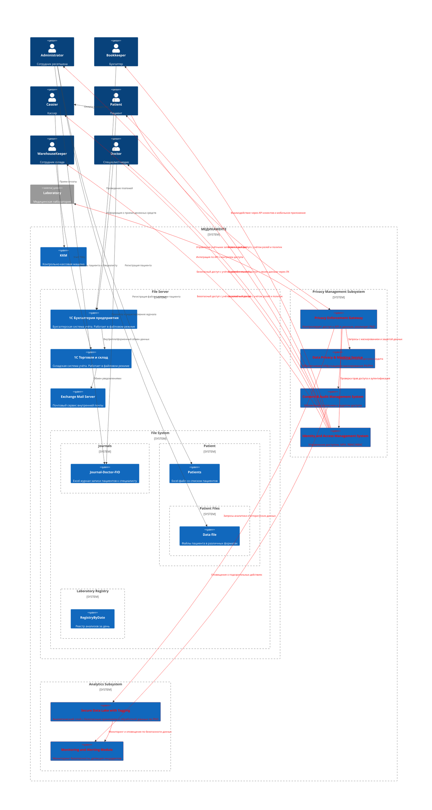

# Задание 2

- Privacy Enforcement Gateway (PEG)
  
  Отдельный компонент, который маршрутизирует все запросы к API и данным, контролирует авторизацию и аутентификацию (RBAC, ABAC), фильтрует запросы по политикам доступа к конфиденциальной информации и ведет аудит. Защищает данные на уровне API интеграций (например, с лабораторией).
  
  Функции: внедрение Zero Trust, проверка прав, аудит, предотвращение утечек.

- Data Privacy and Masking Service (DPMS)
  
  Сервис для динамической маскировки и обфускации данных (например, PII, PHI) при отображении/обработке, в зависимости от ролей пользователя. Также поддерживает безопасное удаление данных по запросам (право на забвение) и контроль жизненного цикла данных.

- Consent and Audit Management System (CAMS)
  
  Управляет согласием пациентов на обработку данных, протоколирует события доступа и изменений с возможностью автоматического оповещения и анализа аномалий доступа.

- Secure Data Lake with Tagging (SDL-T)
  
  Озеро данных для BI/ML/AI с внедренным тегированием данных по категориям конфиденциальности, поддержкой мониторинга доступа, разграничением по ролям и атрибутам, формированием обезличенных/агрегированных выборок для аналитики.

- Monitoring and Alerting Module (MAM)
  
  Модуль централизованного мониторинга безопасности данных, детектирования инцидентов, генерации тревог и оповещений в режиме реального времени.

- Identity and Access Management System (IAM)
  
  Централизованное управление пользователями, ролями, привилегиями, безопасная аутентификация (MFA, OAuth2/OpenID Connect).
