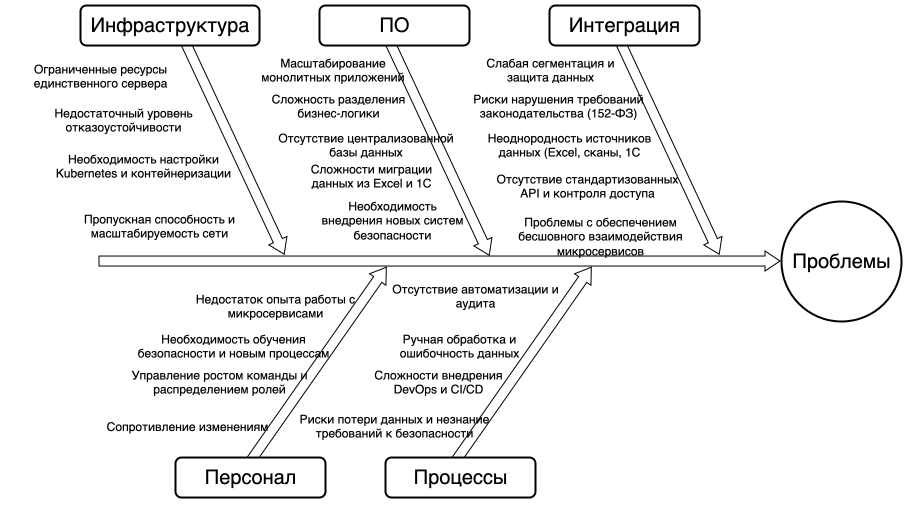

# Задание 4

## Анализ ситуации

**Текущая система**  
- Монолитная архитектура с разрозненными IT-продуктами и данными, хранящимися в Excel, 1С в файловом режиме, на локальном сервере.  
- Отсутствие централизованной системы для работы с медицинскими картами, пациентскими данными и платежами.  
- Работа с конфиденциальными данными без должного контроля доступа и аудита.  
- Серверное оборудование в одном офисе, нагрузка и масштабируемость ограничены.  

**Цели миграции**  
- Переход на современную архитектуру (микросервисы) для масштабируемости, автоматизации и безопасности.  
- Интеграция новых сервисов, BI/ML/AI платформ, порталов для клиентов и сотрудников.  
- Выполнение требований российского законодательства по защите персональных данных и безопасности.  

**Ключевые процессы и компоненты, затрагиваемые миграцией:**  
- Базы данных: миграция с файлового хранения Excel и 1С в централизованные, масштабируемые решения.  
- Коммуникационные каналы: переход от локальных прямых связей к API через Privacy Enforcement Gateway с аутентификацией и авторизацией.  
- Серверное оборудование: переход с одного физического сервера к клaster Kubernetes и облачным/контейнерным решениям.  
- Бизнес-логика: разделение монолита на микросервисы с разграничением ответственности, обработка данных по принципам Privacy by Design.  

## Диаграмма Исикавы

## Основные категории и возможные проблемы

| Категория           | Возможные проблемы                                                                                          |
|---------------------|------------------------------------------------------------------------------------------------------------|
| Инфраструктура      | Ограниченная отказоустойчивость физического сервера, высокая нагрузка, сложность настройки контейнеров   |
| Программное обеспечение | Миграция данных из Excel/1С; разделение монолита на микросервисы; новые системы безопасности и мониторинга |
| Интеграция          | Несогласованность форматов данных; отсутствие стандартизированных API; недостаточная сегментация данных    |
| Персонал            | Недостаток квалификации в новых технологиях; необходимость смены процессов; рост и распределение ролей     |
| Процессы            | Отсутствие автоматизации; неполный аудит доступа и изменений; риски безопасности из-за ручной работы       |

***

## 4. Рекомендации по устранению узких мест

- **Инфраструктура**  
  * Внедрить контейнеризацию (Kubernetes) с поэтапным переносом сервисов.  
  * Обеспечить отказоустойчивость и масштабируемость через кластеризацию и облачные решения.  
  * Настроить мониторинг инфраструктуры и алертинг.  
  **Приоритет:** высокий  

- **Программное обеспечение**  
  * Использовать стратегию Branch by Abstraction для плавного развёртывания микросервисов.  
  * Интегрировать централизованное защищённое хранилище (Secure Data Lake) с тегированием и защитой данных.  
  * Автоматизировать миграцию данных с проверкой качества.  
  **Приоритет:** очень высокий  

- **Интеграция**  
  * Внедрить Privacy Enforcement Gateway для контроля доступа и защиты API.  
  * Обеспечить единые стандарты API для интеграций, включая аудит и логирование.  
  * Обеспечить строгий RBAC/ABAC через IAM.  
  **Приоритет:** очень высокий  

- **Персонал**  
  * Обучить сотрудников новым архитектурным подходам, инструментам безопасности и DevOps-практикам.  
  * Назначить ответственных за соблюдение политики безопасности и качества данных.  
  **Приоритет:** средний  

- **Процессы**  
  * Автоматизировать тестирование и развёртывание через CI/CD.  
  * Внедрить автоматический аудит доступа и изменения данных.  
  * Ввести процессы Data Governance с соблюдением законодательства.  
  **Приоритет:** высокий  
